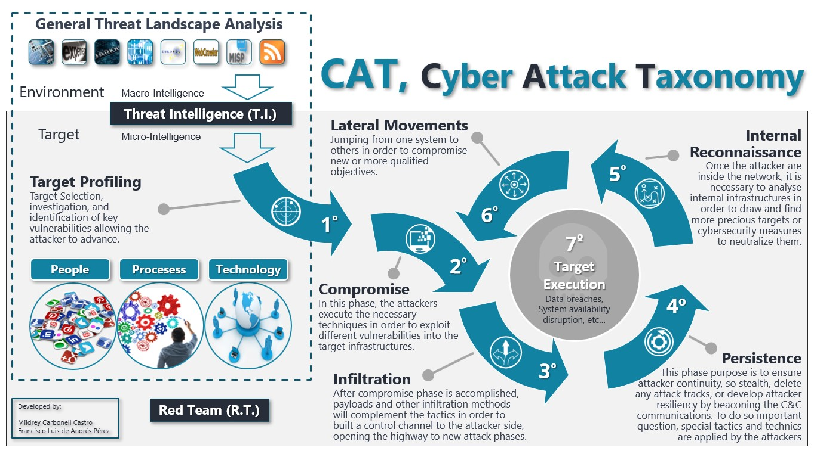

=====================
Cyber Attack Taxonomy
=====================

Team
----

+-----------------+--------------------------------+
| **Github user** | **Name**                       |
+=================+================================+
| Mildreycc_      | Mildrey Carbonell Castro       |
+-----------------+--------------------------------+
| fdeandres_      | Francisco Luis de Andrés Pérez |
+-----------------+--------------------------------+
| fjjcastillo_    | Francisco Jiménez del Castillo |
+-----------------+--------------------------------+

.. _Mildreycc: https://github.com/Mildreycc
.. _fdeandres: https://github.com/fdeandres
.. _fjjcastillo: https://github.com/fjjcastillo

Definition
----------
This taxonomy was developed by the strong study of many other mature taxonomies
and cyber attack analisis like the Cyber Kill Chain (Lockheed Marting),
Diamond model, or the Mitre Att@ck.

Strategy
--------
CAT is defined as the main strategy where Tactics,
Technics and procedures are allocated.
The attack phases are distributed trough this seven steps:

  1. Target Profiling_
  2. Compromise
  3. Infiltration
  4. Persistence
  5. Internal Reconnaissance
  6. Lateral Movements
  7. Target Impact Execution

.. _Target Profiling: CAT Strategy/1. Target Profiling

WorkFlow
--------

